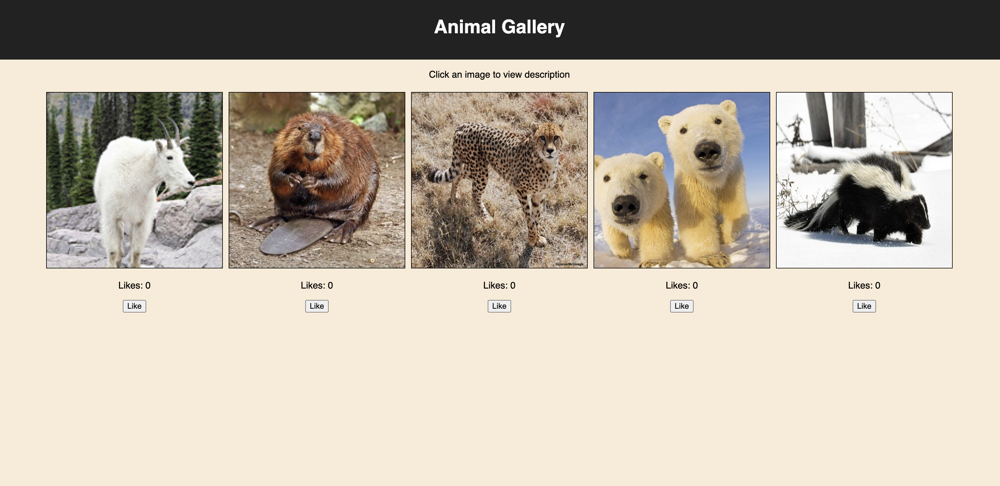
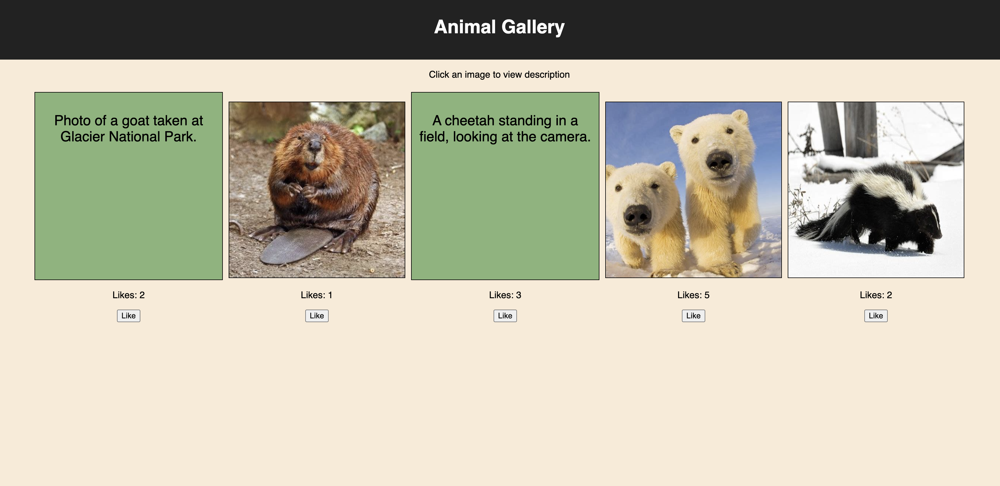

# React Image Gallery

## Description

Create an image gallery using React. Each image shows a description of the image when clicked. When the `Like` button is clicked the "Likes" are updated via a PUT route. All state is stored on the server for base mode.

## Screenshots

Screenshot of page on DOM load

Screenshot of page after image clicks and `Like` button clicks

### Task List
- Use `axios` to retrieve (`GET`) data from to `/gallery` and store it in `App.jsx`.
- Create a new **component** for the `GalleryList` and pass it the gallery data stored in `App` via `props`.
    - Iterate (loop over) the list of gallery data
    - Make GalleryItems
- Create a new **component** called `GalleryItem.jsx` and pass it the individual gallery item via `props`. 
    - Update the `GalleryList` to use this component to display an image.
    - Swap the image with the description on click. Use [conditional rendering](https://reactjs.org/docs/conditional-rendering.html).
    - Display the number likes for each item and include a like button.
    - When the like button is clicked, use `Axios` to update (`PUT`) the like count `/gallery/like/:id`.
    - Update the gallery each time a like button is clicked.
